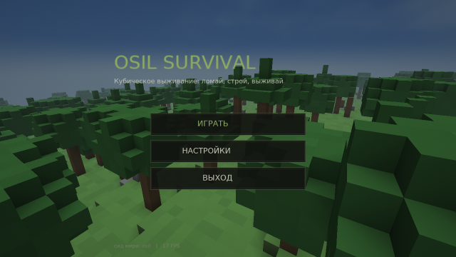
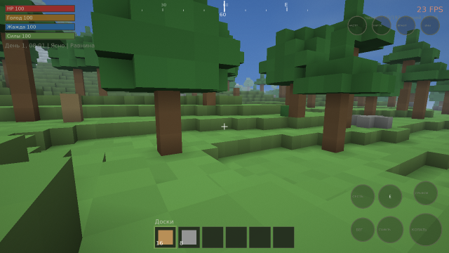
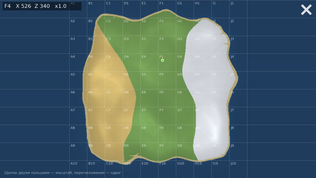
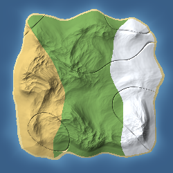

# OSIL Survival

**Игра для Android.** Кубическое выживание в открытом мире: мир из блоков, которые можно
ломать и ставить, на процедурной карте 1000×1000 метров — плюс механики Rust: добыча,
крафт, строительство, рейды, кланы и выделенный сервер на 100+ игроков.

Движок — C++17, перенесён из репозитория
[module-game-A.N.O.D.E](https://github.com/westd72882-glitch/module-game-A.N.O.D.E):
SDL2 + OpenGL ES 3.0, разделение `Engine` / `Game`, сборка APK через Gradle + NDK.

## Скачать

Готовый APK лежит в [Releases](../../releases): каждая сборка публикуется отдельно —
`Сборка #1`, `Сборка #2` и так далее. Скачайте `osil-survival-build-N.apk`, разрешите
установку из неизвестных источников и откройте файл. Нужен Android 7.0+ с OpenGL ES 3.0.
Вместе с APK в релиз кладётся карта мира этого сида и отчёт по биомам и ресурсам.

## Состояние: этап 1 из 5 ✅

| Этап | Содержание | Статус |
|---|---|---|
| 1 | Ядро движка, процедурный мир, биомы, ресурсы, монументы, сутки и погода, каркас сервера, **кубический мир с добычей и строительством**, инвентарь на 30 слотов, базовый крафт, **играбельный Android-клиент с сенсорным управлением** | ✅ готово |
| 2 | Сеть, репликация, авторитарное движение, SQLite, RCON и администрирование | план |
| 3 | Персонаж, метаболизм, инвентарь на 30 слотов, инструменты, крафт, исследования | план |
| 4 | Строительство, стабильность, привилегии, замки, взрывчатка, ловушки, электричество | план |
| 5 | Бой и баллистика, NPC и события, анимации и звук, кланы, транспорт, оптимизация | план |

Подробный план — [docs/ROADMAP.md](docs/ROADMAP.md).

## Управление на телефоне

Левая половина экрана — джойстик движения (появляется под пальцем), правая — обзор
перетаскиванием. Кнопки: **КОПАТЬ** (сломать блок), **СТАВИТЬ** (поставить блок из пояса),
**E** (съесть/напиться), **ПРЫЖОК**, **БЕГ**, **СЕСТЬ**; сверху справа — **ИНВ**,
**КРАФТ**, **КАРТА**, **НАСТР**. Кнопки можно расставить под свою руку: настройки →
«Расставить кнопки». Подробнее — [docs/ANDROID.md](docs/ANDROID.md).

## Сборка из исходников

```bash
# Сервер, утилиты, тесты и отладочный клиент (нужен только C++17 и CMake;
# клиент дополнительно требует SDL2, SDL2_image, SDL2_ttf, SDL2_mixer, GLES3)
cmake -S . -B build -DCMAKE_BUILD_TYPE=Release
cmake --build build -j$(nproc)

./build/bin/osil_tests                    # 31 тест
./build/bin/osil_server                   # выделенный сервер, команда help внутри
./build/bin/osil_mapgen --out build/map   # предпросмотр карты в PNG
./build/bin/osil_client --debug           # клиент на настольной машине
```

APK собирается в CI при каждом пуше (`.github/workflows/build.yml`) и публикуется в
Releases; как собрать его локально — в [docs/ANDROID.md](docs/ANDROID.md).

## Что уже работает

- **Мир 4000×4000 м** из шума Перлина: высота, влажность, температура, реки, остров с
  берегом по периметру. Генерация — ~0.5 с, детерминирована по сиду (один сид → бит-в-бит
  одинаковая карта на сервере и на клиенте, поэтому карту не нужно передавать по сети).
- **7 биомов**: океан, побережье, равнина, лес, пустыня, болото, снежные горы — со своими
  плотностями ресурсов, температурой и расходом воды.
- **~200 тыс. объектов добычи**: сосна, дуб, берёза, сухостой, валуны, скалы,
  металлические и серные жилы, кусты, ягоды, тыквы, грибы, конопля. Рассев
  детерминирован по ячейкам — клиент достраивает мир вокруг игрока сам.
- **Монументы и радиация**: аэродром, военные лагеря, радтауны, заправки, склады, маяки,
  карьеры, пещеры — с площадками, зонами радиации и уровнями лута.
- **Сутки за 60 минут** и погода (ясно, облачно, дождь, туман, снег, гроза), влияющая на
  освещённость, температуру, видимость и ветер; всё детерминировано по времени мира.
- **Выделенный сервер**: фиксированный тик 30 Гц с защитой от «спирали смерти»,
  конфигурация файлом и аргументами, реестр консольных команд (общий с будущим RCON).
- **Утилита предпросмотра карты**: PNG биомов и высот + текстовый отчёт. Свой писатель
  PNG, без зависимостей.
- **Кубический мир**: блоки 1×1×1 м, деревья и валуны из блоков, жилы руды в камне,
  вода, которая растекается в выкопанные ямы. Блоки ломаются (прочность: трава 0.6 с,
  камень 2.2 с, руда 3 с) и ставятся обратно. Правки мира сохраняются, рельеф и декор
  считаются от сида — подробности и оптимизации в [docs/VOXELS.md](docs/VOXELS.md).
- **Три биома крупными зонами**: пустыня на западе, зима на востоке, равнина на севере
  и в центре — по карте можно ориентироваться и есть смысл путешествовать.
- **Дыхание под водой**: вдоха хватает на 45 секунд, дальше игрок тонет.
- **Android-клиент**: мир строится на устройстве из сида, чанки 16×16 подгружаются на
  ходу, отсечение по пирамиде видимости, затенение по углам блоков, небо с солнцем,
  звёздами и облаками, туман по погоде, счётчик кадров в углу (вертикальная синхронизация
  выключена — видно настоящую скорость).
- **Инвентарь на 30 слотов** (6×5) с поясом быстрого доступа и стаками до 1000, крафт
  списком с прокруткой, главное меню с живым фоном, белый компас со шкалой градусов,
  карта почти во весь экран с щипком-приближением и сеткой 10×10 (подпись квадрата стоит
  в самом квадрате), настройки (качество, дальность прорисовки, потолок кадров, звук,
  чувствительность) и редактор раскладки сенсорных кнопок.
- **Ходьба, бег, присед, прыжок, плавание**, автоматический шаг на блок, урон при падении,
  метаболизм по ТЗ (регенерация 1 HP/с при сытости и жажде выше 80).
- **38 тестов**: детерминизм генерации и ГПСЧ, границы значений, «край карты — всегда
  океан», пригодность точек возрождения, рассев ресурсов, расстановка монументов,
  суточный цикл и погода, а также кубический слой — колонка блоков, луч добычи,
  сохранение правок, детерминизм декора.









## Документация

| Документ | О чём |
|---|---|
| [docs/ROADMAP.md](docs/ROADMAP.md) | пять этапов разработки, что входит в каждый и критерии готовности |
| [docs/ARCHITECTURE.md](docs/ARCHITECTURE.md) | структура проекта, слои, цели сборки, цикл сервера |
| [docs/WORLDGEN.md](docs/WORLDGEN.md) | как устроена генерация мира и почему именно так |
| [docs/PROTOCOL.md](docs/PROTOCOL.md) | сетевой протокол, снапшоты, RPC, лагокомпенсация (этап 2) |
| [docs/DATABASE.md](docs/DATABASE.md) | схема SQLite (этап 2) |
| [docs/VOXELS.md](docs/VOXELS.md) | кубический мир: хранение блоков, сборка чанков, отсечение, затенение, добыча |
| [docs/ANDROID.md](docs/ANDROID.md) | Android-клиент: сборка APK, управление на телефоне, настройки производительности |
| [docs/BUILD.md](docs/BUILD.md) | сборка, запуск сервера, команды консоли, настройка, диагностика |
